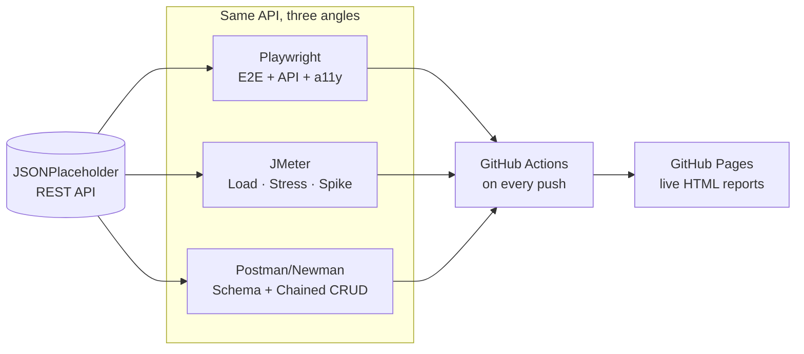
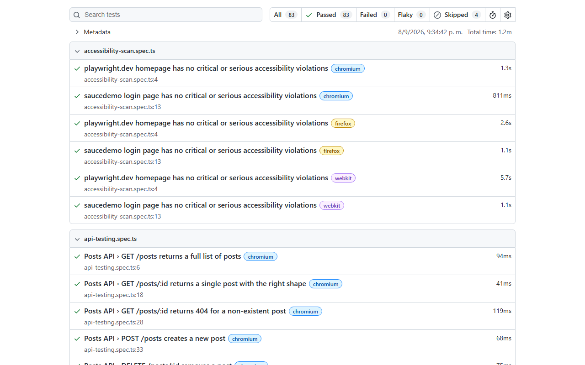
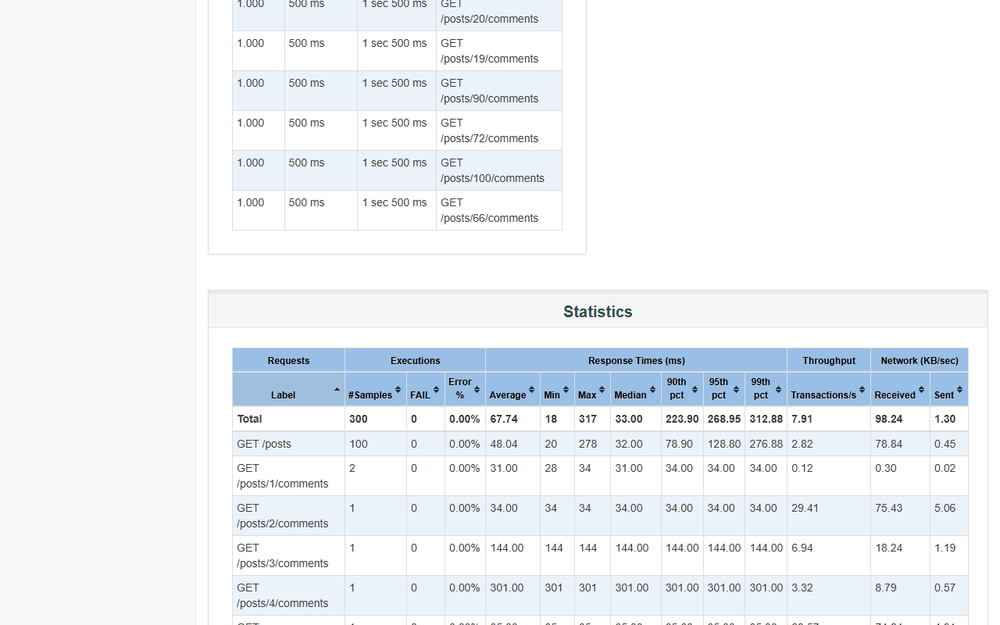
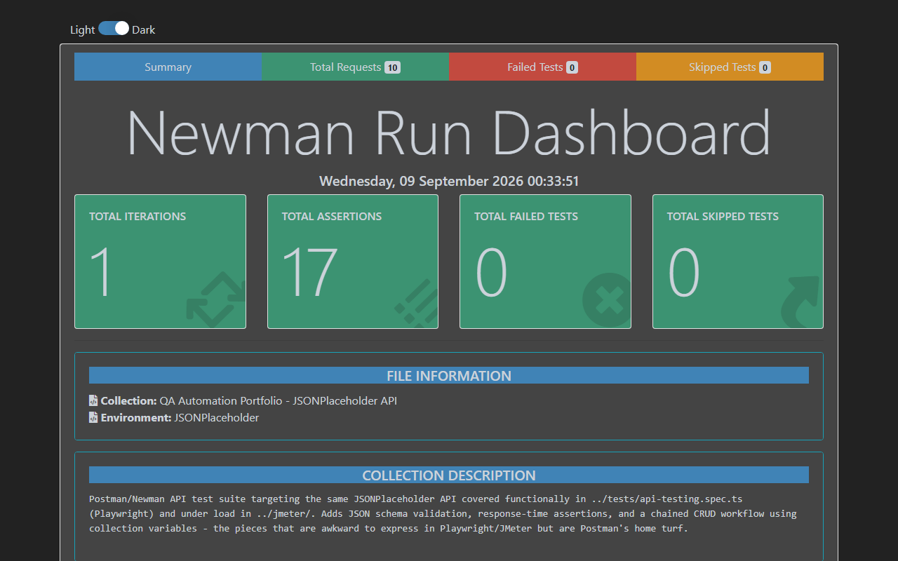

# QA Automation Portfolio

[](https://github.com/Gikza/qa-automation-portfolio/actions/workflows/playwright.yml)
[](https://github.com/Gikza/qa-automation-portfolio/actions/workflows/jmeter.yml)
[](https://github.com/Gikza/qa-automation-portfolio/actions/workflows/postman.yml)

A collection of test suites covering the range of techniques used in real-world QA automation: end-to-end and API testing, data-driven testing, network mocking, accessibility scanning, visual regression, and performance testing — all running automatically on every push via GitHub Actions.

**[Live reports →](https://gikza.github.io/qa-automation-portfolio/)** — CI publishes the latest Playwright, JMeter, and Postman/Newman HTML reports to GitHub Pages on every push to `main`.

- **[`tests/`](tests/)** — end-to-end and API tests built with [Playwright](https://playwright.dev/) and TypeScript, cross-browser (Chromium, Firefox, WebKit)
- **[`jmeter/`](jmeter/)** — load, stress, spike, and CRUD-workflow performance tests built with [Apache JMeter](https://jmeter.apache.org/), targeting the same API covered functionally in `tests/api-testing.spec.ts`
- **[`postman/`](postman/)** — a Postman/Newman collection targeting the same API, covering JSON schema validation, response-time assertions, and a chained CRUD workflow, with notes on using Postman's AI assistant to draft tests

## Architecture

One API, tested three different ways, all wired into the same CI pipeline:



## Screenshots

| Playwright | JMeter | Postman/Newman |
|---|---|---|
| [](https://gikza.github.io/qa-automation-portfolio/playwright/) | [](https://gikza.github.io/qa-automation-portfolio/jmeter/) | [](https://gikza.github.io/qa-automation-portfolio/postman/) |

Click any screenshot to open the live report.

## Playwright suite (`tests/`)

### Stack

- [Playwright Test](https://playwright.dev/docs/intro) — test runner and browser automation
- TypeScript
- [@axe-core/playwright](https://github.com/dequelabs/axe-core-npm) — accessibility scanning
- GitHub Actions — CI, cross-browser, on every push/PR

### Getting started

```bash
npm install
npx playwright install --with-deps
npx playwright test
```

Run a single file or browser:

```bash
npx playwright test tests/api-testing.spec.ts
npx playwright test --project=chromium
```

View the HTML report after a run:

```bash
npx playwright show-report
```

### Test suite

| File | What it demonstrates |
|---|---|
| [`api-testing.spec.ts`](tests/api-testing.spec.ts) | REST API testing (GET/POST/DELETE, status codes, response shape) against JSONPlaceholder |
| [`login-data-driven.spec.ts`](tests/login-data-driven.spec.ts) | Data-driven tests looping over a table of valid/invalid login cases |
| [`e2e-checkout-flow.spec.ts`](tests/e2e-checkout-flow.spec.ts) | Full E2E flow: login → cart → checkout → order confirmation, with total validation |
| [`network-mocking.spec.ts`](tests/network-mocking.spec.ts) | Intercepting and mocking API responses (`page.route`) to test success, empty, and error states without hitting the real backend |
| [`accessibility-scan.spec.ts`](tests/accessibility-scan.spec.ts) | Automated accessibility audits with axe-core |
| [`visual-regression.spec.ts`](tests/visual-regression.spec.ts) | Screenshot comparison for full pages and individual components |
| [`drag-and-drop.spec.ts`](tests/drag-and-drop.spec.ts) | Native HTML5 drag-and-drop interactions |
| [`js-dialogs.spec.ts`](tests/js-dialogs.spec.ts) | Handling `alert`, `confirm`, and `prompt` dialogs |
| [`nested-frames.spec.ts`](tests/nested-frames.spec.ts) | Reading content across nested iframes |
| [`file-handling.spec.ts`](tests/file-handling.spec.ts) | File upload and download flows |
| [`mercadolibre-search.spec.ts`](tests/mercadolibre-search.spec.ts) | A real-world, non-demo site: search flow on MercadoLibre Argentina (skipped in CI, see below) |
| [`example.spec.ts`](tests/example.spec.ts), [`get-started.spec.ts`](tests/get-started.spec.ts) | Playwright basics against playwright.dev |

Most suites run against purpose-built practice sites ([SauceDemo](https://www.saucedemo.com/), [the-internet.herokuapp.com](https://the-internet.herokuapp.com/), [DemoQA](https://demoqa.com/), [JSONPlaceholder](https://jsonplaceholder.typicode.com/)) chosen for stability and to isolate the technique being demonstrated. `mercadolibre-search.spec.ts` is the exception: a real production site included on purpose to show handling of the messiness that comes with it (see below).

### Notes from building this

A few real issues found and worked around along the way, kept here because they're more informative than a green checkmark:

- **MercadoLibre blocks CI traffic.** Its anti-bot system flags GitHub Actions' shared runner IPs as suspicious and serves a stripped-down page instead of real search results. The test is skipped in CI (`test.skip(!!process.env.CI, ...)`) and only runs from a local/residential IP.
- **MercadoLibre's DOM differs by browser engine.** Chromium/Firefox and WebKit render different result-list markup (and A/B test different search box placeholders), so the test asserts on stable signals — URL, page title, results counter, product title class — instead of brittle CSS structure.
- **WebKit can't simulate this app's native drag-and-drop.** [the-internet's drag-and-drop demo](https://the-internet.herokuapp.com/drag_and_drop) relies on the HTML5 `DataTransfer` API set during `dragstart`/`drop`; Playwright can't fully replicate that payload in WebKit, so the drop target ends up empty. Documented and skipped for WebKit only (`test.skip(({ browserName }) => browserName === 'webkit', ...)`), not worked around with something that would silently test the wrong thing.
- **Visual regression baselines are OS-specific.** Playwright namespaces screenshots by platform (`-win32.png` vs `-linux.png`) because font rendering differs between Windows and Linux. Baselines were generated locally on Windows for dev use and separately on Linux via a one-off `generate-snapshots.yml` GitHub Actions job (no Docker required) so CI has its own matching set.
- **Third-party demo services have real-world limits.** The iframe test originally targeted [the-internet's TinyMCE editor demo](https://the-internet.herokuapp.com/iframe), but that shared free-tier API key had hit its monthly quota, putting the editor in read-only mode for everyone. Swapped for a nested-frames test that doesn't depend on an external service's quota.

### CI

Every push and pull request to `main` runs the full suite across Chromium, Firefox, and WebKit via [`.github/workflows/playwright.yml`](.github/workflows/playwright.yml). The HTML report is uploaded as a build artifact for 30 days, and on pushes to `main` it's also published to GitHub Pages — see the [live report](https://gikza.github.io/qa-automation-portfolio/playwright/).

[`.github/workflows/generate-snapshots.yml`](.github/workflows/generate-snapshots.yml) is a manually-triggered (`workflow_dispatch`) job to regenerate Linux visual regression baselines from CI itself, for whenever the SauceDemo login page changes and there's no Docker available locally to reproduce Linux rendering.

## Performance suite (`jmeter/`)

Five [Apache JMeter](https://jmeter.apache.org/) test plans — smoke, load, stress, spike, and a CRUD workflow — targeting the same JSONPlaceholder API covered functionally above, run non-GUI in CI on every push/PR that touches `jmeter/**`, with an HTML dashboard report and raw results uploaded as a build artifact.

See [`jmeter/README.md`](jmeter/README.md) for the full breakdown, the CI error-rate gate, and notes on the design decisions.

## API suite (`postman/`)

A [Postman](https://www.postman.com/)/[Newman](https://github.com/postmanlabs/newman) collection targeting the same JSONPlaceholder API, run non-GUI in CI on every push/PR that touches `postman/**`. Covers the same core cases as the Playwright API suite plus JSON schema validation, response-time assertions, and a chained CRUD workflow using collection variables — the pieces that are Postman's home turf rather than Playwright's or JMeter's.

See [`postman/README.md`](postman/README.md) for the full breakdown, including notes on using Postman's AI assistant to draft `pm.test()` blocks and schemas.
